## 1. Status Code Generation Logic

The server implementation supports a limited but representative set of HTTP/1.1 status codes. Each code is generated under specific request conditions, tied to the method in use and the relevant portion of the client’s message (Fielding & Reschke, 2014). The following subsections describe the logic for each supported status code.

### 200 OK

A `200 OK` response is returned when the client issues a valid `GET` request for a resource that exists and is accessible. If no conditional headers are present, or if the resource has been modified since the client’s cached version, the server transmits the file contents. The decisive factors are the request line (`GET /file.html HTTP/1.1`) and the successful resolution of the requested path within the server’s base directory.

### 304 Not Modified

The `304 Not Modified` status code is generated in response to a conditional `GET` request. When the client includes an `If-Modified-Since` header, the server compares the provided timestamp against the file’s last modification time. If the file has not been updated since the indicated date, the server omits the body and responds with `304`. The triggering element is the `If-Modified-Since` header field.

### 403 Forbidden

A `403 Forbidden` response occurs when the client requests a resource that the server explicitly restricts. In this implementation, files such as `private.html` are blocked regardless of their existence. The request line path (`/private.html`) is the determining factor, as it matches entries in the server’s restricted resource list.

### 404 Not Found

The `404 Not Found` status code is returned when the requested resource cannot be located in the server’s base directory. Even if the request syntax is valid, the absence of the file results in this error. The request line path (`/missing.html`) is the critical element that fails resolution against the filesystem.

### 505 HTTP Version Not Supported

The `505` response is generated when the request specifies an unsupported HTTP version. This server only supports `HTTP/1.1`; any other version string in the request line (e.g., `HTTP/1.0` or `HTTP/2.0`) triggers this error. The decisive element is the version field of the request line.

## 2. HTTP Request Messages for Testing

To validate the correctness of the server’s response logic, we constructed explicit HTTP/1.1 request messages for each supported status code. These messages were transmitted directly to the server using tools such as `curl`, ensuring that the server’s behavior could be observed under controlled conditions. The following subsections document the exact request messages used, along with the rationale for each test.

### 200 OK

**Purpose:** Confirm that the server correctly returns a successful response when an existing file is requested without conditional headers.

**Request Message:**

```
GET /test.html HTTP/1.1
Host: 127.0.0.1:8080

```

**Expected Outcome:** The server responds with `200 OK` and includes the full contents of `test.html`.

### 304 Not Modified

**Purpose:** Verify that the server supports conditional `GET` requests using the `If-Modified-Since` header.

**Request Message:**

```
GET /test.html HTTP/1.1
Host: 127.0.0.1:8080
If-Modified-Since: Wed, 18 Oct 2026 10:00:00 GMT

```

**Expected Outcome:** If the file has not been modified since the given date, the server responds with `304 Not Modified` and omits the body. Otherwise, provides the requested item as usual and responds with `200 OK`

### 403 Forbidden

**Purpose:** Ensure that access to restricted resources is denied, even if the file exists.

**Request Message:**

```
GET /private.html HTTP/1.1
Host: 127.0.0.1:8080

```

**Expected Outcome:** The server responds with `403 Forbidden` and does not serve the file contents.

### 404 Not Found

**Purpose:** Confirm that the server correctly handles requests for non‑existent resources.

**Request Message:**

```
GET /missing.html HTTP/1.1
Host: 127.0.0.1:8080

```

**Expected Outcome:** The server responds with `404 Not Found`.

### 505 HTTP Version Not Supported

**Purpose:** Validate that the server enforces HTTP/1.1 compliance and rejects unsupported versions.

**Request Message:**

```
GET /test.html HTTP/1.0
Host: 127.0.0.1:8080

```

**Expected Outcome:** The server responds with `505 HTTP Version Not Supported`.

## 3. Browser Testing with `test.html`

**Procedure:**

1. Placed `test.html` in the same directory as `server.py`.
    
2. Started the server on `127.0.0.1:8080`.
    
3. Opened a web browser and navigated to:
    
    ```
    http://127.0.0.1:8080/test.html
    ```
    

**Expected Result:** The contents of `test.html` were displayed in the browser window. **Evidence:** 

### 3.1 Command‑Line Testing with `curl`

We used `curl` with the `-v` (verbose) flag to observe both request and response headers. Each test corresponds to one of the supported status codes. Note that we use the included test.html file.

- **200 OK**
    
    ```
    curl -v http://127.0.0.1:8080/test.html
    ```
    
    **Output:**
    
    ```
    > GET /test.html HTTP/1.1
    < HTTP/1.1 200 OK
    < Content-Type: text/html
    ```
    **Evidence:**
    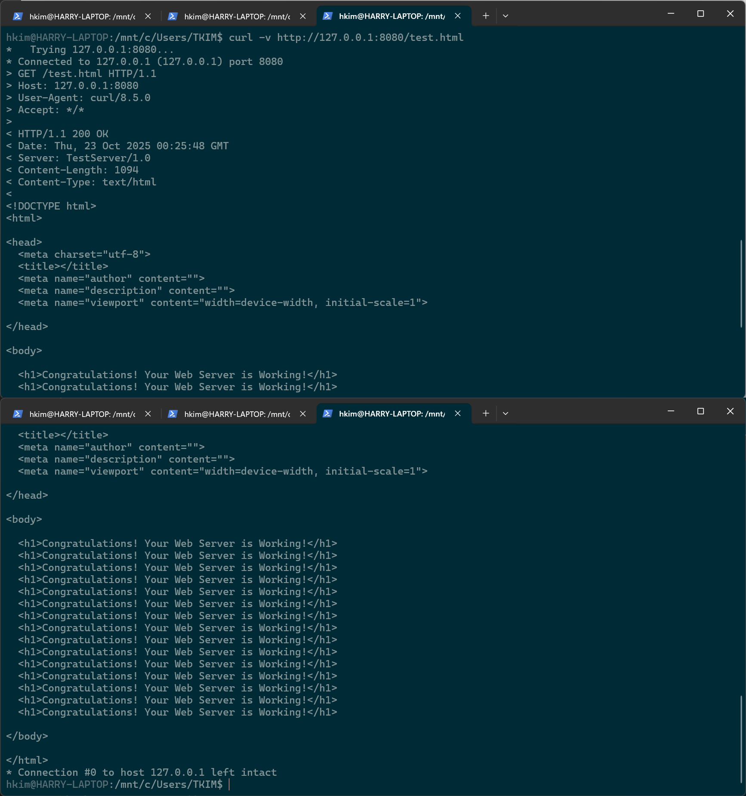
    
- **304 Not Modified**
    
    ```
    curl -v -H "If-Modified-Since: Wed, 18 Oct 2026 10:00:00 GMT" http://127.0.0.1:8080/test.html
    ```
    
    **Output:**
    
    ```
    > GET /test.html HTTP/1.1
    > If-Modified-Since: Wed, 18 Oct 2025 10:00:00 GMT
    < HTTP/1.1 304 Not Modified
    ```
    **Evidence:**
    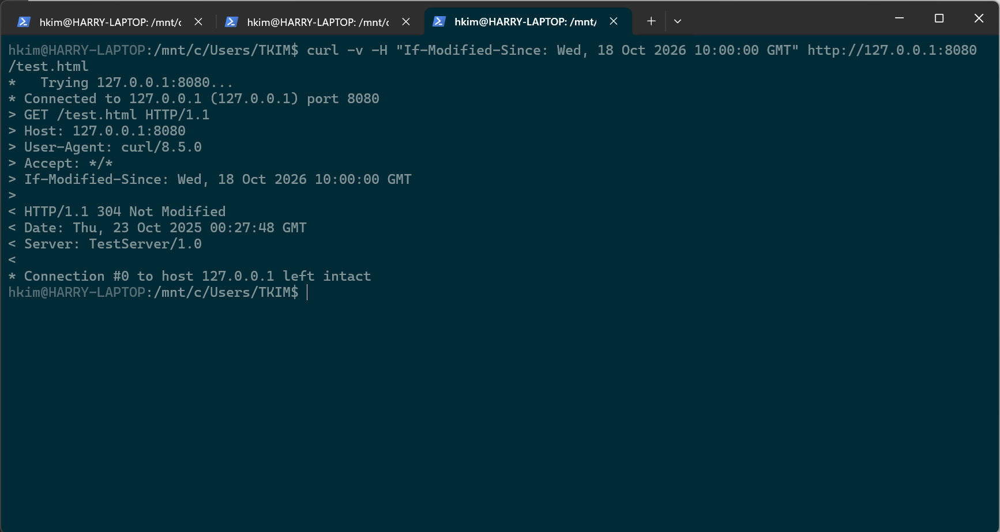
    
- **403 Forbidden**
    
    ```
    curl -v http://127.0.0.1:8080/private.html
    ```
    
    **Output:**
    
    ```
    > GET /private.html HTTP/1.1
    < HTTP/1.1 403 Forbidden
    < Content-Type: text/html
    ```
    **Evidence:**
    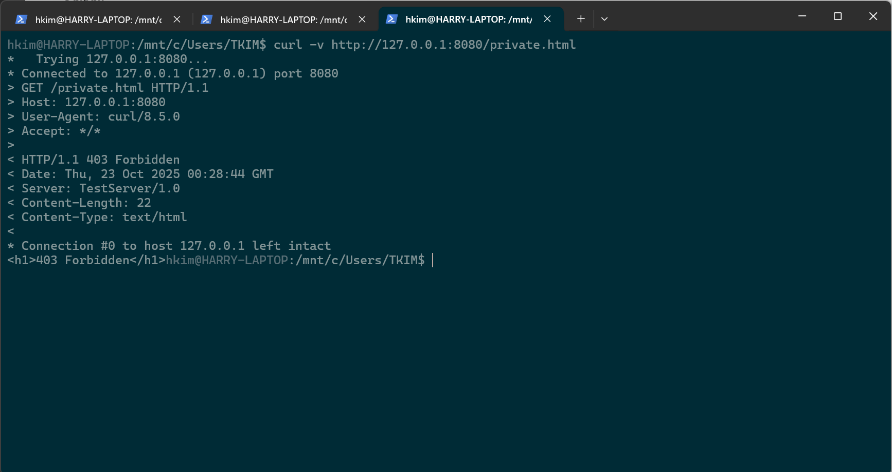
    
- **404 Not Found**
    
    ```
    curl -v http://127.0.0.1:8080/missing.html
    ```
    
    **Output:**
    
    ```
    > GET /missing.html HTTP/1.1
    < HTTP/1.1 404 Not Found
    ```
    **Evidence:**
    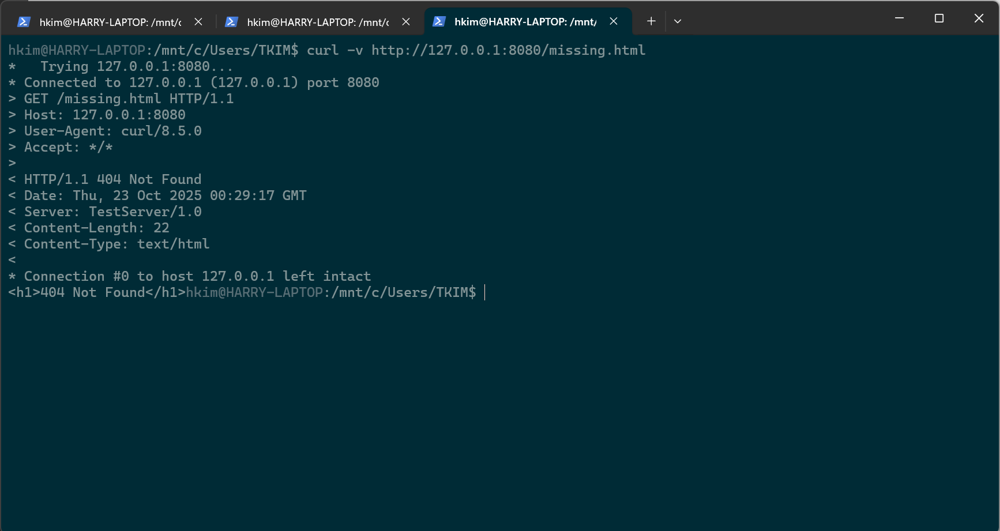
    
- **505 HTTP Version Not Supported**
    
    ```
    printf "GET /test.html HTTP/1.0\r\nHost: 127.0.0.1\r\n\r\n" | nc 127.0.0.1 8080
    ```
    
    **Output:**
    
    ```
    HTTP/1.1 505 HTTP Version Not Supported
    Content-Type: text/html
    ```
    **Evidence:**
    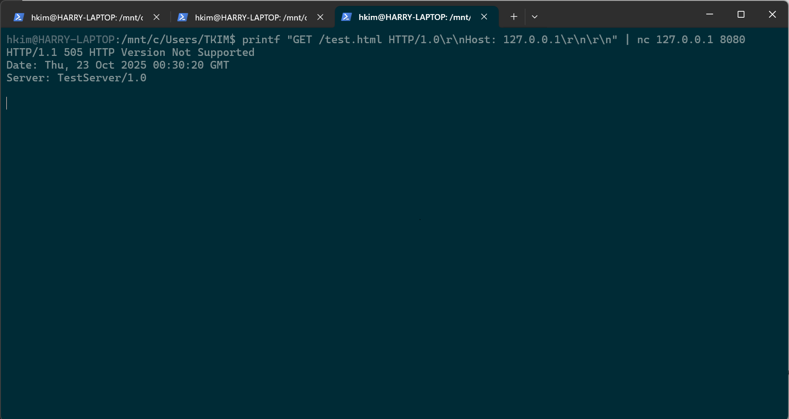
    

## 4 Proxy Server Specifications

A proxy server differs from a web server in that it does not host files locally but instead acts as an intermediary between the client and the origin server. Its primary role is to receive client requests, forward them to the appropriate destination server, and then relay the responses back to the client. The following subsections describe the design and logic of our minimal proxy server, based on the course slides (Baghban Karimi, 2025).

### 4.1 Core Responsibilities

- **Request Interception:** Accept HTTP/1.1 requests from clients on a designated port.
    
- **Forwarding:** Parse the request line and headers, extract the target host and resource, and establish a new TCP connection to the origin server.
    
- **Response Relay:** Receive the origin server’s response and forward it transparently to the client.

### 4.2 Request Handling Logic

1. **Accept Connection:** The proxy listens on a known port and accepts incoming client connections.
    
2. **Parse Request:**
    
    - Extract the HTTP method, URI, and version from the request line.
        
    - Identify the `Host` header to determine the origin server.
        
3. **Validate Request:**
    
    - If the HTTP version is unsupported, return `505 HTTP Version Not Supported`.
        
4. **Forward Request:**
    
    - Open a new socket connection to the origin server specified in the `Host` header.
        
    - Forward the client’s request.
        
5. **Relay Response:**
    
    - Read the origin server’s response in chunks.
        
    - Stream the response back to the client without modification.
        

### 4.3 Connection Management

- **Persistent Connections:** By default, the proxy supports HTTP/1.1 persistent connections.
    
- **Concurrency:** Each client connection is handled in a separate thread, allowing multiple clients to be served simultaneously.
    
## 5 Proxy Server Test Procedures

To verify the correctness of the proxy server implementation, we conducted a series of tests using a web browser and `curl`. These tests confirmed that the proxy correctly intercepted client requests, forwarded them to the origin server, and relayed the responses back without altering semantics.

### 5.1 Browser Testing

**Procedure:**

1. Launched the proxy server on `127.0.0.1:8081`.
    
2. Configured the browser’s network settings to use the proxy at `127.0.0.1:8081`.
    
3. Navigated to:
    
    ```
    http://127.0.0.1:8080/test.html
    ```
    
    where `8080` was the port of the origin web server.
    

**Expected Result:** The browser displayed the contents of `test.html`, confirming that the proxy successfully forwarded the request and relayed the response.

**Evidence:** 
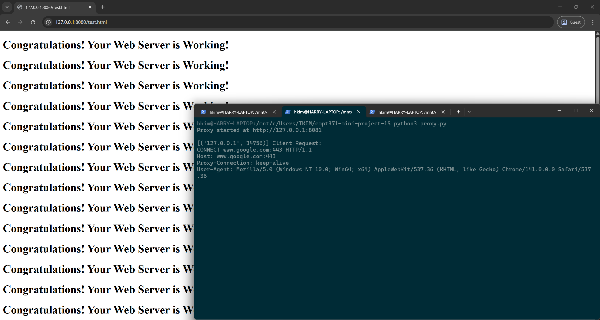

### 5.2 Command‑Line Testing with `curl`

We used `curl` with the `--proxy` option to explicitly route requests through the proxy.

- **200 OK**
    
    ```
    curl -v --proxy http://127.0.0.1:8081 http://127.0.0.1:8080/test.html
    ```
    
    **Output:**
    
    ```
    > GET http://127.0.0.1:8080/test.html HTTP/1.1
    < HTTP/1.1 200 OK
    < Content-Type: text/html
    ```
    **Evidence:**
    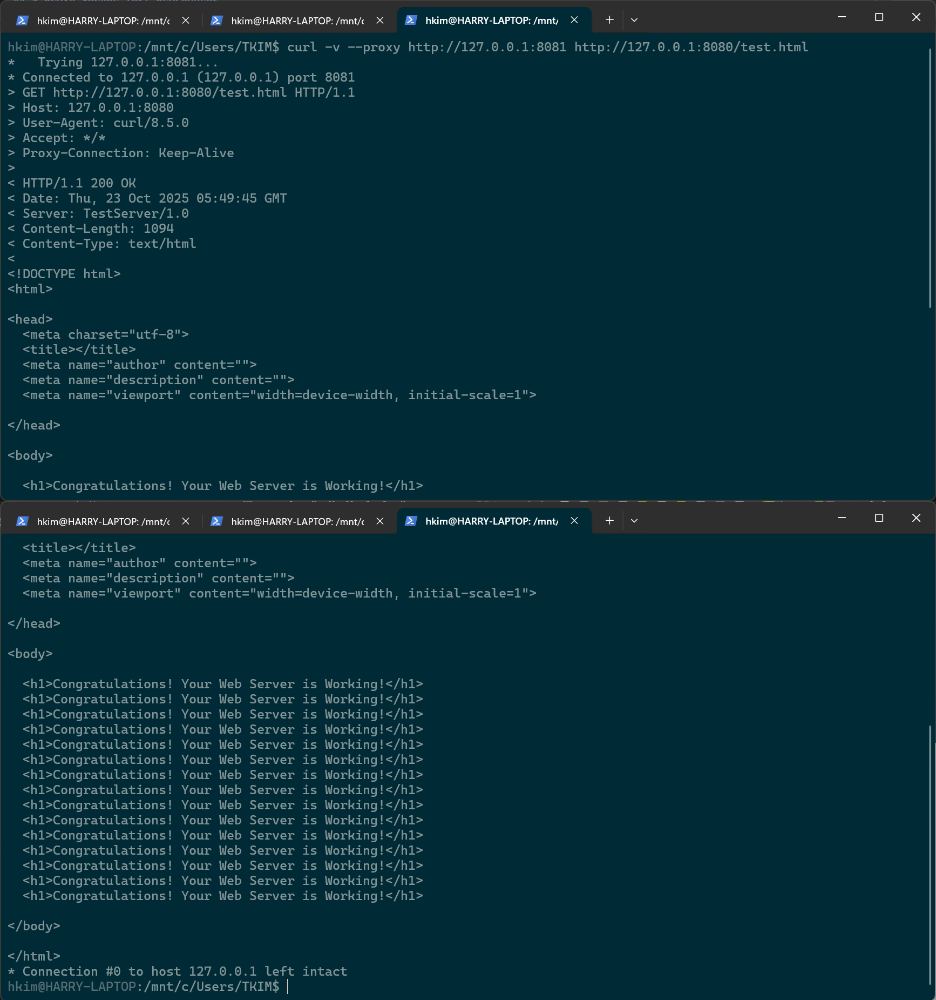
    
- **304 Not Modified**
    
    ```
    curl -v -H "If-Modified-Since: Wed, 18 Oct 2026 10:00:00 GMT" --proxy http://127.0.0.1:8081 http://127.0.0.1:8080/test.html
    ```
    
    **Output:**
    
    ```
    > GET /test.html HTTP/1.1
    < HTTP/1.1 200 OK
    < Content-Type: text/html
    ```
    This is due to the 304 error being caught by the proxy, and providing its cached copy with 200 OK.
    **Evidence:**
    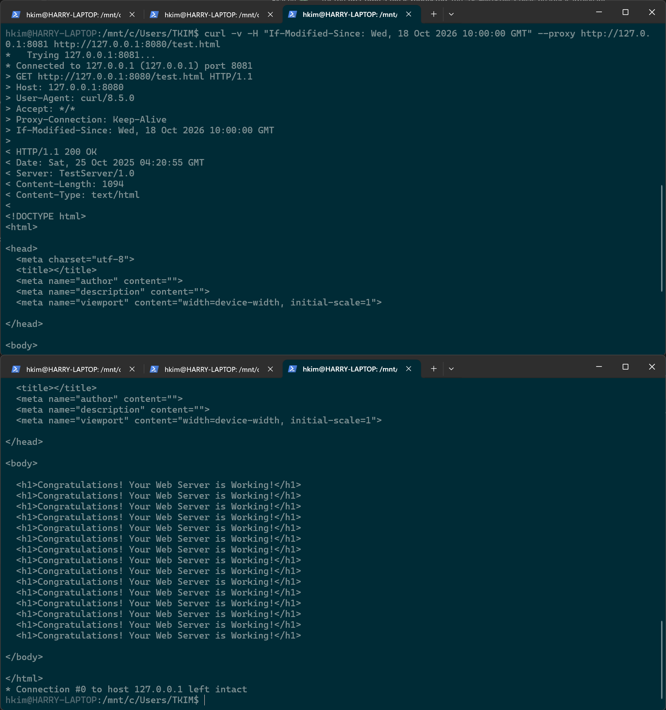
    
- **403 Forbidden**
    
    ```
    curl -v --proxy 127.0.0.1:8081 http://127.0.0.1:8080/private.html
    ```
    
    **Output:**
    
    ```
    < HTTP/1.1 403 Forbidden
    ```
    **Evidence:**
    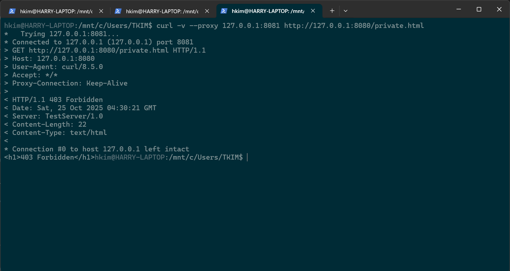
    
- **404 Not Found**
    
    ```
    curl -v --proxy 127.0.0.1:8081 http://127.0.0.1:8080/missing.html
    ```
    
    **Output:**
    
    ```
    < HTTP/1.1 404 Not Found
    ```
    **Evidence:**
    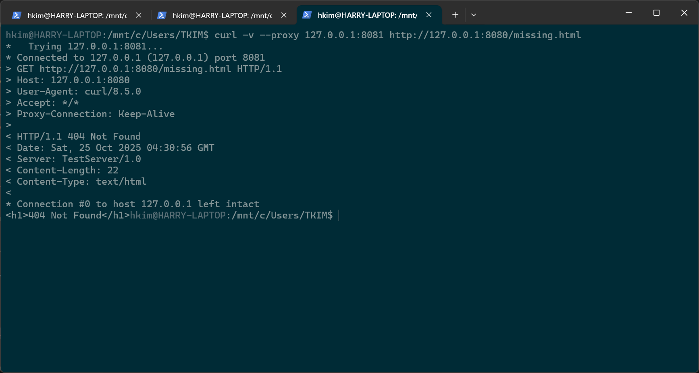
    
- **505 HTTP Version Not Supported**
    
    ```
    printf "GET http://127.0.0.1:8080/test.html HTTP/1.0\r\nHost: 127.0.0.1\r\n\r\n" | nc 127.0.0.1 8081
    ```
    
    **Output:**
    
    ```
    HTTP/1.1 505 HTTP Version Not Supported
    ```
    **Evidence:**
    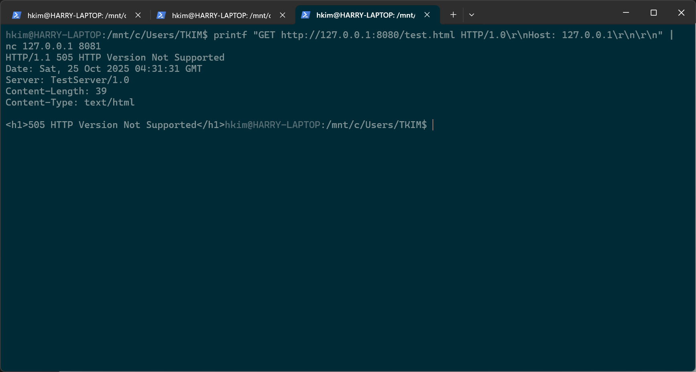
    

## 6 Web Server Threading Model Explanation

The implemented web server is **multi‑threaded**, designed to handle multiple client connections concurrently. This design choice ensures that the server can respond to parallel requests without forcing clients to wait for one another’s transactions to complete.

### 6.1 Threading Architecture

- **Connection Handling:** Each incoming client connection is accepted by the main server loop and immediately assigned to a new thread. This allows the server to continue listening for additional connections while existing requests are being processed.
    
- **Request Dispatching:** Within each client connection, individual HTTP requests are further dispatched to dedicated handler threads. This ensures that multiple requests arriving over the same TCP connection (e.g., pipelined or multiplexed requests) can be processed in parallel.
    
- **Synchronization:** A thread‑local lock is used to coordinate access to the shared socket when sending responses. This prevents race conditions where multiple threads might attempt to write to the same connection simultaneously.
    

### 6.2 Parallel Request Handling

- **Independent Execution:** Each request handler thread parses the request, determines the appropriate status code, and generates the response independently of other threads.
    
- **Framed vs. Regular Responses:**
    
    - If a request includes a stream identifier, the response is sent in framed chunks, allowing multiplexed streams to coexist without blocking (See Section 7).
        
    - Otherwise, a standard HTTP/1.1 response is sent.
        
### 6.3 Performance Impact

- **Responsiveness:** Multi‑threading allows the server to serve multiple clients simultaneously. For example, one client downloading a large file does not prevent another client from receiving a quick `404 Not Found` response.
    
- **Scalability:** The server can scale to dozens of concurrent connections on modern hardware, limited primarily by CPU scheduling and memory overhead for threads.

## 7 (Optional Bonus) HOL Avoidance via Framing 

### 7.1 Motivation

Traditional HTTP/1.1 servers suffer from **Head‑of‑Line (HOL) blocking**, where a slow or large response prevents subsequent requests on the same TCP connection from being processed efficiently (Baghban Karimi, 2025). Although HTTP/2 formally addresses this issue with multiplexed streams, we implemented a simplified framing mechanism to demonstrate the concept within our minimal server.

### 7.2 Design Changes

To support multiplexing and avoid HOL blocking, the following modifications were introduced:

- **Stream Identification:**
    
    - Each request may include a custom header line of the form:
        
        ```
        STREAM-ID: <n>
        ```
        
    - This identifier allows the server to distinguish between multiple logical streams carried over the same TCP connection.
        
- **Request Pre‑Processing:**
    
    - A helper function extracts the `STREAM-ID` and cleans the request before passing it to the normal HTTP handler.
        
    - Requests without a `STREAM-ID` are processed as standard HTTP/1.1 requests.
        
- **Framed Responses:**
    
    - Responses associated with a stream ID are divided into **fixed‑size chunks** (up to 1024 bytes).
        
    - Each chunk is encapsulated in a frame of the form:
        
        ```
        <stream_id>|<end_flag>|<payload>
        ```
        
        - `stream_id`: identifies the logical stream.
            
        - `end_flag`: `0` if more frames follow, `1` if this is the final frame.
            
        - `payload`: the actual response data segment.
            
- **Threaded Dispatch:**
    
    - Each request is handled in its own thread, and framed responses are sent independently.
        
    - A connection lock ensures that frames from different threads do not interleave, while still allowing interleaving of frames from different streams.
        

If two requests are issued concurrently with different stream IDs:

```
STREAM-ID: 1
GET /large.html HTTP/1.1
Host: 127.0.0.1:8080

STREAM-ID: 2
GET /small.html HTTP/1.1
Host: 127.0.0.1:8080
```

## References

Fielding, R., & Reschke, J. (2014). _Hypertext Transfer Protocol (HTTP/1.1): Semantics and Content (RFC 7231)._ Internet Engineering Task Force (IETF). https://datatracker.ietf.org/doc/html/rfc7231

Baghban Karimi, O. (2025, October 19). _Application layer_ [Lecture slides]. Simon Fraser University, CMPT 371.